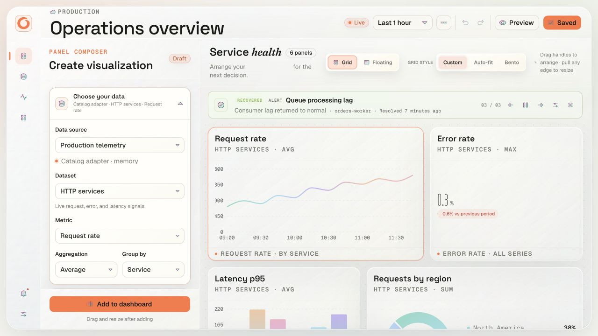

<div align="center">
  

  

  <h1>Orbit</h1>
  <p><strong>An expressive dashboard studio for operational signals.</strong></p>
  <p>Compose, arrange, and share the dashboards your team needs to see what is happening.</p>

  <p>
    <a href="#highlights">Explore Orbit</a> ·
    <a href="#quick-start">Quick start</a> ·
    <a href="./ARCHITECTURE.md">Architecture</a>
  </p>

  <p>
    
    
    
    
  </p>
</div>

## Highlights

The [Orbit icon pack](./design/brand/orbit-icon-pack.zip) includes SVG masters,
outlined wordmarks, light/dark app icons, PNG sizes, favicons, and web-app assets.
See the [identity guide](./design/brand/README.md) for usage and regeneration.

- **Build panels in context.** Choose a data source, dataset, metric, aggregation, and grouping; configure the visualization and see a live preview before adding it.
- **Arrange dashboards your way.** Switch between isolated Grid and Floating workspaces. Drag, resize, group, tab, dock, and hide panels without coupling the two layout models.
- **Explore a broad chart toolkit.** Use time series, bars, areas, stats, gauges, pie/donut, heatmaps, histograms, state timelines, status history, tables, logs, alert lists, uptime, date-time, and clocks.
- **Go further with related views.** Try Streamgraph, Brush, Waffle, Ridgeline, Sankey, Funnel, Radar, Realtime Stream, Race Bar, humidity, progress, sleep-range, and pull-to-refresh visualizations.
- **Tune every panel.** Set separate grid and floating titles, typography, alignment, color palettes and gradients, conditional thresholds, and chart-specific options.
- **Keep up with the signal.** Surface rotating alerts and notices in the dashboard announcement bar; use a clock, service uptime history, and live sample streams alongside metric charts.
- **Work safely.** Undo and redo edits, save versioned dashboard state, and import or export validated dashboard JSON.
- **Stay responsive.** The composer and dashboard adapt to smaller screens, with editing controls available in a mobile sheet.

## Quick start

```bash
git clone https://github.com/amirtaherkhani/orbit.git
cd orbit
npm ci
npm run dev
```

Open the local URL printed by Vite (usually `http://localhost:5173`).

### Verify a production build

```bash
npm run lint
npm run typecheck
npm run build
```

## Visualization catalog

| Category | Included views |
| --- | --- |
| Trends | Time series, area, bar, brush chart, streamgraph, realtime stream |
| Metrics | Stat, gauge, bar gauge, progress ticks, humidity wheel |
| Distribution | Donut, pie, heatmap, histogram, ridgeline, waffle |
| Reliability | Uptime, status history, state timeline, alerts |
| Operations | Table, logs, text, dashboard list, clock, date-time |
| Analysis | Sankey flow, funnel, radar, race bar, sleep range, pull-to-refresh |

Panels share a typed data-frame contract and palette/threshold tokens, so the same metric can be explored through different visual forms.

## How it fits together

```text
Dashboard composer
        ↓
Versioned dashboard + panel model
        ↓
Typed plugin registry
   ┌────┼───────────┐
Panels  Data sources  Filters / transforms / exporters
   └────┼───────────┘
        ↓
Query runtime → normalized data frames → chart renderer
```

The registry keeps panel rendering, data-source adapters, filters, transforms, protocols, and exporters behind explicit contracts. See [ARCHITECTURE.md](./ARCHITECTURE.md) for runtime boundaries and the production integration roadmap.

## Project structure

```text
src/
├── components/dashboard/  # Composer, grid/floating canvases, and panel renderers
├── components/arc/        # MIT-licensed Arc chart components and notice
├── core/plugins/          # Plugin contracts and registry
├── core/runtime/          # Query execution and normalized results
├── plugins/               # Built-in panels, data sources, transforms, and exports
├── data/                  # Sample metric catalog
└── types/                 # Dashboard and panel document types
```

## Demo data and integrations

Orbit is currently a **front-end dashboard prototype**, not a monitoring backend. The included catalog and live stream are sample/browser-side data. The SQL gateway adapter is an integration boundary that expects a separately implemented server endpoint at `/api/datasources/sql/query`; no database credentials or Kubernetes connection are bundled with this repository. Do not put production secrets in client-side code.

## Built with

React 19 · TypeScript · Vite · Tailwind CSS 4 · shadcn/ui and Radix UI · Recharts · Trellis · Motion · Phosphor Icons

## License

The Orbit application does not currently declare a repository-wide license. The Arc chart components in `src/components/arc/` retain their upstream MIT license and attribution in that directory. Do not assume the rest of the repository is licensed for reuse.
